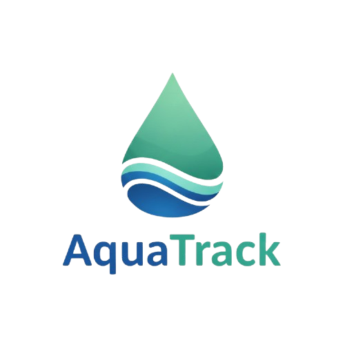

<div align="center">



# AquaTrack 💧

**A beautiful, feature-rich daily water intake tracker built with Flutter**

[](https://flutter.dev/)
[](https://dart.dev/)
[](https://riverpod.dev/)
[](https://flutter.dev/)
[](LICENSE)

[Features](#-features) • [Installation](#-installation) • [Screenshots](#-screenshots) • [Tech Stack](#-tech-stack) • [Documentation](#-documentation) • [Contributing](#-contributing)

</div>

---

## ✨ Features

### 🎯 Core Hydration Tracking

| Feature | Description |
|---------|-------------|
| 👤 **Personalized Experience** | Login with your name for a personalized greeting every time you open the app |
| 🧮 **Smart Goal Calculation** | Automatic water goal calculation based on your weight and activity level |
| 🎯 **Custom Goals** | Override calculated goals with your own personalized target |
| ⚡ **Container Presets** | Save and reuse your favorite water containers for quick logging |
| 📊 **Visual Progress** | Beautiful circular progress bar with real-time updates and dynamic coloring |
| 💬 **Motivational Messages** | Dynamic encouragement based on your progress and streaks |
| 🔥 **Streak Tracking** | Track consecutive days of meeting your hydration goals with milestone celebrations |
| 📅 **History View** | Browse past daily records with beautiful weekly chart visualizations |
| 🔔 **Smart Reminders** | Optional notifications to keep you hydrated throughout the day |
| 🌙 **Dark Mode** | Easy-on-the-eyes dark theme with smooth transitions |

### 🎮 Gamification & Engagement

| Feature | Description |
|---------|-------------|
| 🏆 **Achievements System** | 18 unique achievements across 4 categories (First Steps, Streaks, Consistency, Milestones) |
| 🎉 **Celebrations** | Confetti animations and popups when goals are reached and achievements unlocked |
| 📈 **Weekly Charts** | Beautiful animated bar charts showing 7-day progress with goal lines |
| ⏪ **Undo Functionality** | Quickly undo accidental water entries within 10 seconds |
| 🎯 **Weekly Challenges** | 25+ rotating weekly challenges with difficulty levels and point rewards |
| 🛒 **Shop System** | Purchase themes, icons, badges, containers, and animations with earned points |
| ⭐ **Points System** | Earn points by completing challenges and unlock exclusive rewards |

### 📊 Analytics & Insights

| Feature | Description |
|---------|-------------|
| 📈 **Hydration Score** | Daily score (0-100) based on goal completion, consistency, and streak maintenance |
| 📅 **Monthly Calendar** | Color-coded heatmap showing daily completion status |
| 📉 **Trend Analysis** | Long-term intake trends with visual graphs |
| 🕐 **Time Distribution** | Pie chart showing when you drink most throughout the day |
| 💡 **Smart Insights** | Personalized suggestions based on your hydration patterns |
| 📊 **Statistics Dashboard** | Comprehensive stats including averages, completion rates, and totals |

### 🔧 Developer & Testing Features

| Feature | Description |
|---------|-------------|
| 🐛 **Debug Menu** | Comprehensive testing tools accessible via 7-tap easter egg |
| ⚡ **Performance Monitoring** | Real-time FPS, build count, and build time tracking |
| 📊 **Provider Analytics** | Track state management performance and provider updates |
| 🔄 **App Restart** | Quick app restart functionality for testing flows |
| 🎲 **Cheat Actions** | Quick actions for testing water intake, streaks, achievements, and challenges |

---

## 📱 Screenshots

<div align="center">

*Screenshots coming soon...*

<!-- Add your screenshots here


-->

</div>

---

## 🚀 Installation

### Prerequisites

- **Flutter SDK** 3.0 or higher
- **Dart** 3.0 or higher
- **Android Studio** / **Xcode** (for mobile development)
- **VS Code** or **Android Studio** (recommended IDEs)

### Quick Start

```bash
# Clone the repository
git clone https://github.com/yourusername/aquatrack.git

# Navigate to project directory
cd aquatrack

# Install dependencies
flutter pub get

# Generate Hive adapters (if needed)
flutter pub run build_runner build --delete-conflicting-outputs

# Run the app
flutter run
```

### Platform-Specific Setup

<details>
<summary><b>📱 Android</b></summary>

No additional setup required. Just run:

```bash
flutter run -d android
```

**Notifications:** For Android 13+, the app will request notification permission at runtime.

</details>

<details>
<summary><b>🍎 iOS</b></summary>

```bash
cd ios
pod install
cd ..
flutter run -d ios
```

**Notifications:** Add to `ios/Runner/Info.plist`:

```xml
<key>UIBackgroundModes</key>
<array>
  <string>fetch</string>
  <string>remote-notification</string>
</array>
```

</details>

<details>
<summary><b>🌐 Web</b></summary>

```bash
flutter run -d chrome
```

> ⚠️ **Note:** Push notifications are not supported on web platform. The app will gracefully handle this.

</details>

---

## 🛠️ Tech Stack

| Technology | Purpose | Version |
|------------|---------|---------|
| **Flutter** | Cross-platform UI framework | 3.0+ |
| **Dart** | Programming language | 3.0+ |
| **Riverpod** | State management | 2.4+ |
| **Hive** | Local database storage | Latest |
| **flutter_local_notifications** | Push notifications | Latest |
| **percent_indicator** | Circular progress visualization | Latest |
| **fl_chart** | Beautiful charts and graphs | 0.66+ |
| **confetti** | Celebration animations | 0.7+ |
| **google_fonts** | Beautiful typography | Latest |

---

## 📁 Project Structure

```
lib/
├── main.dart                      # App entry point, routing & theme
│
├── models/                        # Data models & Hive adapters
│   ├── water_entry.dart           # WaterEntry, UserSettings, DailySummary
│   ├── water_entry.g.dart         # Hive type adapters
│   ├── container.dart             # WaterContainer model
│   ├── container.g.dart           # Container adapter
│   ├── achievement.dart           # Achievement definitions & unlocks
│   ├── achievement.g.dart          # Achievement adapter
│   ├── challenge.dart             # Challenge definitions & active challenges
│   ├── challenge.g.dart            # Challenge adapter
│   ├── shop_item.dart             # Shop items & purchased items
│   └── shop_item.g.dart           # Shop adapter
│
├── providers/                     # State management
│   └── providers.dart             # All Riverpod providers
│
├── screens/                       # App screens
│   ├── splash_screen.dart         # App startup with personalized greeting
│   ├── login_screen.dart          # Name-based login
│   ├── profile_setup_screen.dart  # Weight, activity, goal setup
│   ├── home_screen.dart           # Main dashboard
│   ├── history_screen.dart        # Historical data with charts
│   ├── challenges_screen.dart     # Weekly challenges
│   ├── shop_screen.dart           # Shop for purchasing items
│   ├── achievements_screen.dart   # Achievement gallery
│   ├── settings_screen.dart       # App preferences
│   └── debug_screen.dart          # Developer tools
│
├── services/                      # Business logic
│   ├── storage_service.dart       # Hive CRUD operations
│   ├── notification_service.dart  # Notification handling
│   └── analytics_service.dart     # Analytics & insights calculations
│
├── widgets/                       # Reusable UI components
│   ├── progress_bar.dart          # Circular progress indicator
│   ├── water_add_buttons.dart     # Quick-add & container buttons
│   ├── motivational_message.dart  # Dynamic encouragement
│   ├── weekly_chart.dart          # Chart visualizations
│   ├── challenge_card.dart        # Challenge progress card
│   └── celebration.dart           # Achievement & goal celebrations
│
└── theme/                         # Theming
    └── app_theme.dart             # Centralized theme definitions
```

---

## 🎨 Key Features in Detail

### 🎯 Weekly Challenges

AquaTrack features **25+ unique challenges** across multiple categories:

- **Early Morning Challenges** - Start your day right with morning hydration
- **Multiple Logs Challenges** - Build consistency by logging frequently
- **Exceed Goal Challenges** - Push yourself to go beyond your daily goal
- **Perfect Days Challenges** - Maintain perfect streaks
- **Total Volume Challenges** - Reach weekly volume targets
- **Consistency Challenges** - Drink at specific times

Each challenge has:
- ⭐ Difficulty levels (Easy, Medium, Hard)
- 🏆 Point rewards (10, 25, or 50 points)
- 📊 Progress tracking with visual indicators
- 🎉 Celebration animations on completion

### 🛒 Shop System

Earn points by completing challenges and spend them in the shop:

- **🎨 Themes** - Customize your app appearance
- **🖼️ Icons** - Change your app icon
- **🏅 Badges** - Show off your achievements
- **🥤 Containers** - Unlock special water containers
- **✨ Animations** - Custom celebration effects

### 📊 Analytics & Insights

Get deep insights into your hydration habits:

- **Daily Hydration Score** - 0-100 score based on goal completion, consistency, and streaks
- **Weekly Average Score** - Track your improvement over time
- **Best/Worst Hydration Times** - Know when you drink most/least
- **Day-of-Week Patterns** - Discover your weekly patterns
- **Improvement Suggestions** - Personalized tips based on your data

---

## 🎨 Customization

### Change Theme Colors

Edit `lib/theme/app_theme.dart` to customize colors:

```dart
// Light theme
static final ThemeData light = ThemeData(
  colorScheme: ColorScheme.fromSeed(
    seedColor: const Color(0xFF0EA5E9), // Your color here
    brightness: Brightness.light,
  ),
);
```

### Add Quick-Add Amounts

Edit `quickAddAmountsProvider` in `lib/providers/providers.dart`:

```dart
QuickAddAmount(label: '750ml', amountMl: 750),
```

### Customize Motivational Messages

Edit `motivationalMessageProvider` in `lib/providers/providers.dart` to add your own messages.

### Add New Challenges

Use the factory method in `lib/models/challenge.dart`:

```dart
Challenges.create(
  'my_challenge',
  'My Challenge',
  'Description here',
  ChallengeDifficulty.easy,
  7,
  ChallengeType.perfectDays,
  {},
)
```

---

## 📖 Documentation

For detailed technical documentation, see [DOCUMENTATION.md](DOCUMENTATION.md)

For feature roadmap and ideas, see [FEATURES.md](FEATURES.md)

---

## 🤝 Contributing

Contributions are welcome! We'd love to have you contribute to AquaTrack.

### How to Contribute

1. **Fork the repository**
2. **Create your feature branch** (`git checkout -b feature/AmazingFeature`)
3. **Commit your changes** (`git commit -m 'Add some AmazingFeature'`)
4. **Push to the branch** (`git push origin feature/AmazingFeature`)
5. **Open a Pull Request**

### Contribution Guidelines

- Follow the existing code style
- Add comments for complex logic
- Update documentation as needed
- Test your changes thoroughly
- Follow the project structure

### Feature Requests

Have an idea? Check out [FEATURES.md](FEATURES.md) for planned features or open an issue to suggest new ones!

---

## 📄 License

This project is licensed under the MIT License - see the [LICENSE](LICENSE) file for details.

---

## 🙏 Acknowledgments

- [Flutter](https://flutter.dev/) - Beautiful native apps in record time
- [Riverpod](https://riverpod.dev/) - A simple way to access state
- [Hive](https://docs.hivedb.dev/) - Lightweight and blazing fast key-value database
- [fl_chart](https://github.com/imaNNeoFighT/fl_chart) - Beautiful charts for Flutter
- [confetti](https://github.com/codegrue/flutter_confetti) - Celebration animations

---

<div align="center">

**Made with 💙 for hydration enthusiasts**

[⭐ Star this repo](https://github.com/yourusername/aquatrack/stargazers) if you find it helpful!

[🐛 Report Bug](https://github.com/yourusername/aquatrack/issues) • [💡 Request Feature](https://github.com/yourusername/aquatrack/issues)

</div>
